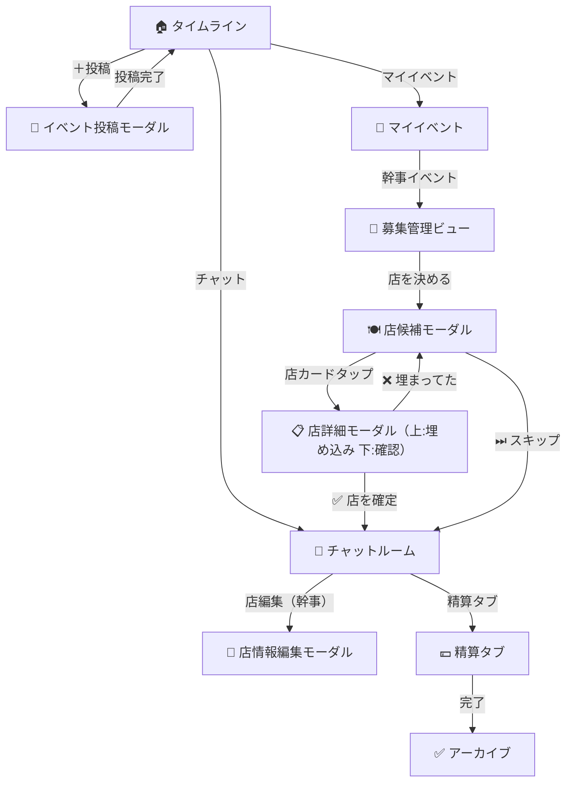

# 🍶 ゆる誘い OS — UI フロー構成（Figma 参照用）v1.7

---

## 🎯 目的

Figma での画面設計・プロトタイプ接続を行うための最小構成。
画面・モーダル単位の関係を明示し、Prototype リンク設定を容易にする。

---

## 🧭 ページ構成（Frame 構造）

```
/frames
 ├─ 01_Home_Timeline
 ├─ 02_Event_Post_Modal
 ├─ 03_My_Events
 ├─ 04_Organizer_View
 ├─ 05_Store_List_Modal
 ├─ 06_Store_Detail_Modal
 ├─ 07_Chat_Room
 ├─ 08_Store_Edit_Modal
 ├─ 09_Settlement_Tab
 ├─ 10_Complete_Archive
 └─ 11_Settings
```

---

## 📱 画面遷移（Mermaid）



---

## 🧩 ノード解説

| 画面                    | 概要                                     |
| ----------------------- | ---------------------------------------- |
| 🏠 タイムライン         | 匿名イベント一覧＋右下投稿ボタン         |
| 📝 イベント投稿モーダル | カテゴリ・日時・コメント入力             |
| 📅 マイイベント         | 幹事中 👑／参加中イベント一覧            |
| 👑 募集管理ビュー       | 幹事操作：参加確定／店選定／募集再開     |
| 🍽 店候補モーダル        | AI 候補 3 件＋スキップボタン             |
| 📋 店詳細モーダル       | 上：食べログ埋め込み／下：予約確認ボタン |
| 💬 チャットルーム       | 店情報＋メッセージ＋精算タブ切替         |
| 🧾 店情報編集モーダル   | 手動予約登録（URL→OGP 展開）             |
| 💴 精算タブ             | 支払い登録／傾斜設定／進捗確認           |
| ✅ 完了画面             | 支払い完了後のアーカイブ表示             |
| ⚙️ 設定                 | 通知トグル／プロフィール等               |

---

## 🧠 Prototype 設計ガイド（Figma 内）

| 要素           | 設定                                      |
| -------------- | ----------------------------------------- |
| 投稿ボタン     | → イベント投稿モーダル                    |
| イベントカード | → 募集管理ビュー or チャット              |
| 「店を決める」 | → 店候補モーダル                          |
| 店カード       | → 店詳細モーダル                          |
| 「埋まってた」 | → 再表示（同フレーム内 State 切替）       |
| 「スキップ」   | → チャットルーム（店未確定 State）        |
| 「店編集」     | → 店情報編集モーダル                      |
| 「精算」       | → 精算タブ                                |
| 「完了」       | → アーカイブ画面                          |
| 戻る／×        | Prototype Back transition（Overlay 閉鎖） |

---

## 💡 UI レイアウト指針

| 項目             | 内容                                       |
| ---------------- | ------------------------------------------ |
| モーダル         | 全画面＋下固定ボタン構成                   |
| 下部ナビ         | タイムライン／マイイベント／チャット／設定 |
| 投稿ボタン       | 右下 FAB 固定                              |
| 食べログ埋め込み | 上部全体 scroll、下部ボタン固定            |
| 精算タブ         | チャット画面 Variant で切替                |
| 通知トグル       | 設定画面内、更新は自動反映                 |

---

**version:** 1.7
**for:** Figma prototype / UI 連携設計
**authors:** お前さん × GPT-5
**date:** 2025-11-11
